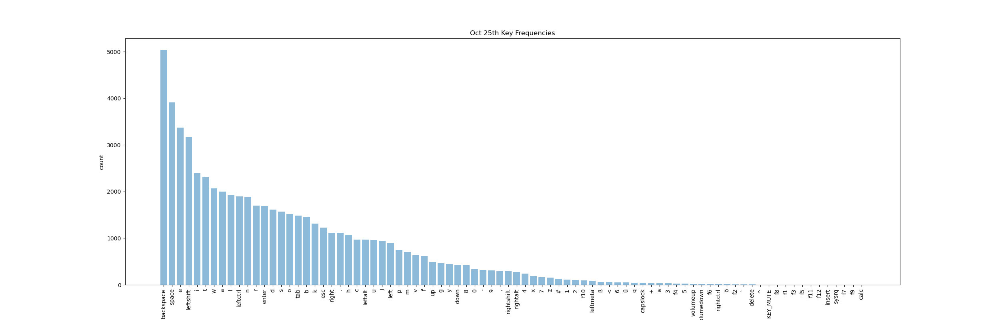

<p align="center">

</p>
<p align="center">  
  keys pressed! 
</p>
<p align="center">
  (This number updates regularly)
</p>

## Entropy

I spend a lot of time in front of a computer, doing very important stuff [reference] (like writing questionable code - link to image displaying some sort of programming-crime I have commited, perhaps in this very project? update: it won't be hard to find one). A substantial share of that time is devoted to thinking about what to type, and a little less is then spent actually typing it.
However, I have to wonder: What am I actually typing all the time?

Let's start with a brief detour to the entire realm of possible input events we are facing. To get a baseline, we can consider all input events which are [mapped by the Linux kernel](https://github.com/torvalds/linux/blob/master/include/uapi/linux/input-event-codes.h).
For our purposes we'll use the [evdev](https://github.com/gvalkov/python-evdev) python library, which among other things exposes these integer constants.

We are quick to start suspecting that

```python
import evdev

print(len(evdev.ecodes.keys))  # 596
```

596 (!) possible input events exceeds the number of keys on my laptop keyboard by a fair bit (it's got 81 in case you're wondering, and even my external full-size one doesn't sport more than 109). Granted, some of these (looking at the function keys) can cause different events, but even if we're being generous here, the number of keys we are nowhere near almost 600. Turns out this has a good reason: There are a lot more devices this has to work with, each providing different (methods of) inputs. Here are some of my favorites (some are mapped to multiple values):

- 209: KEY_BASSBOOST
- 152: [KEY_COFFEE, KEY_SCREENLOCK]
- 85: KEY_ZENKAKUHANKAKU (according to a [quick search](https://sqa.stackexchange.com/questions/7929/what-is-keys-zenkaku-hankaku-in-webdriver), this Japanese modifier key will switch between half- (Hankaku) and full-width (Zenkaku))
- along with [BTN_TRIGGER_HAPPY1 up to BTN_TRIGGER_HAPPY40](https://anvilproject.org/guides/content/creating-links)

For our purposes, it'll suffice to only consider the (types of) events of keys which were actually pressed in the regarded timeframe (since we are most interested in larger timeframes, say, at least days, most most of the more common keys will likely have been pressed anyway).

# The fun part

I have been collecting information about what I hammer into my keyboards all day for the last couple of weeks now (I've done so using a way too complicated bloated piece of software I wrote in C a while back, capturing the events from /dev/input).

To get a sense of what we're working with, let's first plot the keys with their counts of a particular day:



Phew. First of all, seems like I'm doing a lot of undoing. A whopping 8.4% of key presses on that day were devoted to deleting something. Second, that's a lot of keystrokes! In total, **60237** between 0 am and 12 pm. With the average english word length being 4.7 characters, that's closing in on 13000 words on a single day. At this pace it would take me around 90 days to type out all 8 books of the Harry Potter series.

Of course, this number gets bloated by backspace and other keys like shift and alt, which by themselves don't actually contribute any characters.

```python
keys_to_exclude = ['backspace', 'leftshift', 'rightshift', 'leftctrl', 'rightctrl']
print(sum([count for key, count in key_frequencies.items() if key not in keys_to_exclude]))  # 48585
```

With these not considered, we're closer to around 50000 characters on that day.

If we only look at the letters (excluding the German Umlaute ä, ö and ü as well as ß) we get the following distribution:


Comparing it to the [relative letter frequency in the english language](https://en.wikipedia.org/wiki/Letter_frequency)


we see that there are some diversions, giving away that I like to use Vim keybindings (look at w, b, k, j).

Looking again at the first graph, it includes the raw keystrokes, i.e., it doesn't apply the modifiers (Shift, AltGr). If you've been wondering why I seem to be liking the 8 and 9 quite a bit, it's because on the German QWERTZ layout these are the keys which house the square brackets (when combined with Shift). After applying the Shifts and AltGrs we get the following:


[To be continued]
